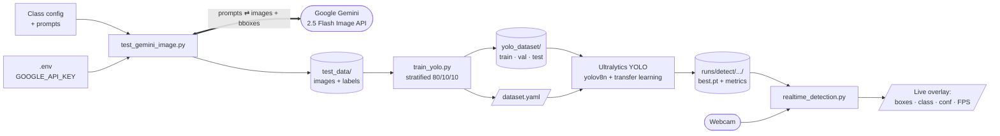

# YOLO Gesture Detection Project

A complete pipeline for training and deploying a YOLO-based gesture detection model. This project uses Google Gemini API to generate synthetic training data, trains a YOLO model using Ultralytics, and provides real-time gesture detection via webcam.

**Tags:** Software, AI4CI

For guidance on what to include in Tutorials, How-To Guides, Explanation, and Reference, see [Diátaxis](https://diataxis.fr/).

### License

[](https://www.gnu.org/licenses/gpl-3.0)

## References

- [Ultralytics YOLO](https://docs.ultralytics.com/) — YOLO model training and inference framework.
- [Google Gemini API](https://ai.google.dev/gemini-api/docs) — generative model used to produce synthetic training images.
- [Diátaxis](https://diataxis.fr/) — documentation framework used to structure this README.

## Acknowledgements

*National Science Foundation (NSF) funded AI institute for Intelligent Cyberinfrastructure with Computational Learning in the Environment (ICICLE) (OAC 2112606)*

## Issue reporting

Please report issues at [https://github.com/ICICLE-ai/high_school_io_2025/issues](https://github.com/ICICLE-ai/high_school_io_2025/issues).

---

# How-To Guides

## Features

- **Synthetic Data Generation**: Uses Google Gemini 2.5 Flash Image API to generate diverse training images with bounding boxes
- **YOLO Training**: Automated training pipeline with train/val/test splits
- **Real-time Detection**: Live webcam gesture detection with interactive controls
- **4-Class Gesture Recognition**: Detects thumb_up, thumb_down, rotate, and peace_sign gestures

## Project Structure

```
high_school_io_2025/
├── test_gemini_image.py      # Generate synthetic dataset using Gemini API
├── train_yolo.py             # Train YOLO model with automatic data splitting
├── realtime_detection.py     # Real-time gesture detection via webcam
├── dataset.yaml              # YOLO dataset configuration
├── test_data/                # Generated images and labels
│   ├── images/
│   └── labels/
├── yolo_dataset/             # Organized train/val/test splits
│   ├── train/
│   ├── val/
│   └── test/
└── runs/detect/              # Training outputs and model weights
```

## Setup

### 1. Install Dependencies

```bash
pip install -r requirements.txt
```

### 2. Configure Environment

Create a `.env` file in the project root:

```bash
# Google Gemini API Key
# Get your API key from: https://makersuite.google.com/app/apikey
GOOGLE_API_KEY=your_api_key_here
```

## Usage

### Step 1: Generate Synthetic Dataset

Generate training images using Google Gemini API:

```bash
python test_gemini_image.py
```

**What it does:**
- Generates synthetic images for 4 gesture classes using Gemini API
- Creates tight bounding boxes around hands in each image
- Saves images and YOLO-format labels to `test_data/`
- Default: 10 samples per class (configurable in script)

**Classes Generated:**
- `thumb_up` (class_id: 0) - Thumbs up gesture
- `thumb_down` (class_id: 1) - Thumbs down gesture
- `rotate` (class_id: 2) - Stop hand sign (palm facing forward)
- `peace_sign` (class_id: 3) - Raised index and middle fingers in a V sign gesture

**Output Structure:**
```
test_data/
├── images/
│   ├── thumb_up_001.jpg
│   ├── thumb_up_002.jpg
│   ├── thumb_down_001.jpg
│   └── ...
└── labels/
    ├── thumb_up_001.txt
    ├── thumb_up_002.txt
    ├── thumb_down_001.txt
    └── ...
```

**Customizing Generation:**
Edit `test_gemini_image.py` to modify:
- Number of samples per class (default: 10)
- Class configuration in `dataset_config` dictionary
- Prompt variations for diversity

### Step 2: Train YOLO Model

Train the YOLO model with automatic data splitting:

```bash
python train_yolo.py
```

**What it does:**
- Automatically splits data into stratified train/val/test sets (default: 80/10/10 per class)
- Creates YOLO dataset structure in `yolo_dataset/`
- Generates `dataset.yaml` configuration file
- Trains YOLO model (default: YOLOv8n nano model)
- Auto-detects device (MPS for Mac M1/M2, CPU otherwise)

**Training Configuration:**
Edit `train_yolo.py` to customize:
- `MODEL_SIZE`: 'n' (nano), 's' (small), 'm' (medium), 'l' (large), 'x' (xlarge)
- `EPOCHS`: Number of training epochs (default: 100)
- `BATCH_SIZE`: Batch size (default: 16)
- `TRAIN_RATIO`, `VAL_RATIO`, `TEST_RATIO`: Data split ratios
- `CLASS_NAMES`: Class names (must match dataset.yaml)

**Output:**
- Best model: `runs/detect/yolo_training/weights/best.pt`
- Last model: `runs/detect/yolo_training/weights/last.pt`
- Training plots and metrics in `runs/detect/yolo_training/`

### Step 3: Real-time Detection

Run real-time gesture detection using your webcam:

```bash
python realtime_detection.py
```

**Features:**
- Live webcam feed with bounding boxes and labels
- Interactive confidence threshold adjustment
- FPS display and detection count
- Color-coded classes:
  - Green: thumb_up
  - Red: thumb_down
  - Purple: rotate
  - Yellow: peace_sign

**Controls:**
- `q`: Quit
- `c`: Cycle confidence threshold (0.1, 0.2, 0.3, 0.5)
- `+` or `=`: Increase confidence by 0.05
- `-`: Decrease confidence by 0.05
- `1`: Set threshold to 0.3
- `2`: Set threshold to 0.5
- `3`: Set threshold to 0.7
- `4`: Set threshold to 0.9

**Configuration:**
Edit `realtime_detection.py` to customize:
- `MODEL_PATH`: Path to model weights (auto-detects if None)
- `CONF_THRESHOLD`: Default confidence threshold (default: 0.3)
- `CAMERA_ID`: Camera device ID (default: 0)

## Class Mapping

The project uses 4 gesture classes with the following IDs:

| Class Name | Class ID | Description |
|------------|----------|-------------|
| `thumb_up` | 0 | Thumbs up gesture |
| `thumb_down` | 1 | Thumbs down gesture |
| `rotate` | 2 | Stop hand sign (palm facing forward) |
| `peace_sign` | 3 | Raised index and middle fingers in a V sign gesture |

## Label Format

Each label file (`.txt`) contains YOLO format annotations:

```
class_id center_x center_y width height
```

All values are normalized (0-1). Example:
```
0 0.523456 0.456789 0.234567 0.345678
```

## Dataset Configuration

The `dataset.yaml` file defines the dataset structure:

```yaml
path: /path/to/yolo_dataset
train: train/images
val: val/images
test: test/images

nc: 4
names: ['thumb_up', 'thumb_down', 'rotate', 'peace_sign']
```

## Requirements

- Python 3.8+
- PyTorch (with MPS support for Mac M1/M2)
- Ultralytics YOLO
- OpenCV
- Google Gemini API key

See `requirements.txt` for complete dependency list.

## Notes

- **API Key**: The Gemini API key is required for data generation. Get it from [Google AI Studio](https://makersuite.google.com/app/apikey)
- **Model Weights**: Pre-trained YOLOv8 weights are automatically downloaded on first run
- **Device Detection**: The training script automatically uses MPS (Metal Performance Shaders) on Mac M1/M2 for GPU acceleration
- **Data Continuity**: The data generation script continues from existing indices, so you can add more samples without overwriting existing data
- **Balanced Splits**: `train_yolo.py` now performs stratified splitting so each class stays evenly represented in train/val/test
- **Confidence Threshold**: Higher thresholds (0.7-0.9) reduce false positives but may miss some detections

## Troubleshooting

**Camera not opening:**
- Try changing `CAMERA_ID` to 1 or check camera permissions
- On Mac, grant camera permissions in System Settings

**Model not found:**
- Ensure you've trained a model first using `train_yolo.py`
- Or specify `MODEL_PATH` in `realtime_detection.py`

**API errors:**
- Verify your `GOOGLE_API_KEY` is set correctly in `.env`
- Check API quota and rate limits
- The script includes automatic retry logic

**Training issues:**
- Reduce `BATCH_SIZE` if you run out of memory
- Use smaller model size ('n' instead of 's', 'm', etc.)
- Ensure you have enough training data (recommended: 100+ images per class)

---

# Explanation

This project demonstrates an end-to-end pipeline that combines **generative AI** with **computer vision training** to bootstrap a working object detector without manually collecting and labelling images.

## Architecture

The system is a four-stage pipeline. Each stage is a self-contained script that reads from one well-defined data artifact and writes to the next, so any stage can be re-run, swapped out, or inspected in isolation.

Shape legend: **rectangles** are processes/scripts, **cylinders** are persisted data artifacts, **hexagons** are external services or hardware, **parallelograms** are user-facing I/O.



### Reading the diagram

- **Stage 1** is the only stage that reaches outside the repo — it consumes a `GOOGLE_API_KEY` and the class/prompt config, then round-trips with the Gemini API to materialise `test_data/`.
- **Stage 2** is a pure local transform: it stratifies `test_data/` into `yolo_dataset/{train,val,test}/` and emits `dataset.yaml` so Ultralytics knows where to look.
- **Stage 3** consumes both the organised dataset and `dataset.yaml`, picks the best available accelerator (MPS on Apple Silicon, CPU otherwise), and writes weights + training plots to `runs/detect/`.
- **Stage 4** is decoupled from training — it only needs `best.pt` and a webcam, so you can ship the trained model anywhere a Python + OpenCV environment exists.

## Stage 1 — Synthetic data generation with Gen AI

Instead of collecting real photographs of every gesture, `test_gemini_image.py` calls Google's **Gemini 2.5 Flash Image** API. For each gesture class (`thumb_up`, `thumb_down`, `rotate`, `peace_sign`) the script:

- Sends a prompt that describes the gesture and asks the model to generate a realistic image of a hand performing it.
- Asks the model to return a tight bounding box around the hand, which is then converted into the YOLO label format (`class_id center_x center_y width height`, all normalized to `[0, 1]`).
- Writes the image to `test_data/images/` and the matching label to `test_data/labels/`.

The entire training corpus is **synthesised on demand** — you can grow the dataset by re-running the script, which continues from existing indices so previous samples are preserved.

## Stage 2 — Splitting into a YOLO-friendly layout

`train_yolo.py` doesn't train directly on `test_data/`. It first reorganises the synthetic data into the directory layout that Ultralytics expects:

- A **stratified split** (default 80/10/10) is applied per class so train, val, and test each see every gesture in roughly the same proportion. This avoids the failure mode where validation accuracy looks great because one rare class happens to be missing from val.
- The script materialises the result under `yolo_dataset/{train,val,test}/{images,labels}/` and writes a matching `dataset.yaml` that points at those paths and lists the four class names.

## Stage 3 — Training the YOLO model

With the dataset on disk, `train_yolo.py` hands off to Ultralytics:

- Loads a pre-trained YOLOv8 backbone (default: nano `yolov8n`) so we transfer-learn instead of training from scratch.
- Auto-selects MPS on Apple Silicon and falls back to CPU otherwise.
- Trains for the configured number of epochs and saves `best.pt` / `last.pt` plus metric plots under `runs/detect/yolo_training*/`.

## Stage 4 — Real-time inference

`realtime_detection.py` loads `best.pt`, opens the webcam, and runs the detector frame-by-frame, drawing per-class boxes and an FPS counter. The confidence threshold can be tuned live with the keyboard so you can see how a synthetic-only training set generalises to real hands in real lighting.

## Why this design?

- **Synthetic data is cheap.** Generating a balanced 4-class dataset takes minutes and zero manual labelling — ideal for a teaching/demo context.
- **Stratified splitting matters.** Even with synthetic data, class-balanced val/test sets are needed to trust the metrics.
- **Transfer learning over from-scratch.** Starting from pre-trained YOLO weights lets a small synthetic dataset still produce a usable detector.
- **Loose coupling between stages.** Each script owns one stage (generate → organise → train → infer), so any stage can be re-run or replaced (e.g., swap Gemini for a different image generator) without touching the others.
