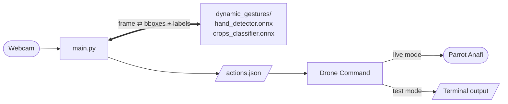

# Gesture-Controlled Drone

Control a Parrot Anafi drone with hand gestures — no model training required. Show your hand to a webcam and the app maps what it sees to drone commands you define in a simple config file (`actions.json`).

**Tags:** Software, AI4CI

For guidance on what to include in Tutorials, How-To Guides, Explanation, and Reference, see [Diátaxis](https://diataxis.fr/).

---

## Quick Start

```bash
# 1. Install dependencies (see Setup below for conda path)
pip install -r requirements.txt

# 2. Run in test mode — no drone needed
bash run.sh
# or directly:
python main.py
```

A window opens with your webcam feed. Show a hand gesture — bounding boxes appear on screen and the detected gesture prints in the terminal. Nothing connects to a drone in test mode.

> **`run.sh`** is a convenience script for Anaconda users. It activates the `dynamic_gestures` conda environment then runs `main.py`. If you're not using conda, just run `python main.py` directly.

---

### License

[](https://www.gnu.org/licenses/gpl-3.0)

## References

- [HaGRID Dynamic Gestures](https://github.com/hukenovs/hagrid) — gesture dataset and ONNX models used for detection.
- [SoftwarePilot](https://github.com/AutonoFly/SoftwarePilot) — drone control library used in live mode.
- [Ultralytics YOLO](https://docs.ultralytics.com/) — YOLO framework (detachable alternative detection engine).
- [Diátaxis](https://diataxis.fr/) — documentation framework used to structure this README.

## Acknowledgements

*National Science Foundation (NSF) funded AI institute for Intelligent Cyberinfrastructure with Computational Learning in the Environment (ICICLE) (OAC 2112606)*

## Issue reporting

Please report issues at [https://github.com/ICICLE-ai/high_school_io_2026/issues](https://github.com/ICICLE-ai/high_school_io_2026/issues).

---

# How-To Guides

## Features

- **No Training Needed**: Uses pre-trained ONNX models — just run and go
- **45+ Gesture Classes**: Detects a wide range of hand gestures out of the box (like, dislike, fist, peace, stop, ok, point, and more)
- **Easy Action Config**: Map any gesture to a drone command by editing `actions.json` — no code changes needed
- **Test & Live Modes**: Run safely with no drone connected (`test`) or send real flight commands (`live`)
- **Bounded Movement**: Built-in position tracking prevents the drone from flying too far in any direction
- **Swappable Detection Engine**: YOLO or any other detector can be plugged in with a one-line change

## Project Structure

```
high_school_io_2026/
├── main.py              ← the app — start here
├── actions.json         ← configure which gestures do what
├── run.sh               ← launches via the conda environment
├── requirements.txt     ← all Python dependencies
└── dynamic_gestures/    ← gesture detection engine (pre-trained, no edits needed)
    ├── models/
    │   ├── hand_detector.onnx      ← finds hands in the frame
    │   └── crops_classifier.onnx   ← classifies which gesture is shown
    ├── main_controller.py          ← glues the two models together
    └── utils/
        └── enums.py                ← full list of gesture labels
```

## Setup

### 1. Install Dependencies

**With conda (recommended if you have Anaconda):**

```bash
conda create -n dynamic_gestures python=3.9 -y
conda activate dynamic_gestures
pip install -r requirements.txt
```

Then use `bash run.sh` to launch — it activates the `dynamic_gestures` environment automatically.

**Without conda:**

```bash
pip install -r requirements.txt
python main.py
```

No API keys. No model training. The pre-trained gesture models are already included in `dynamic_gestures/models/`.

## Usage

### Running the App

```bash
bash run.sh       # if using conda
# or
python main.py    # if using a regular Python environment
```

Press `q` in the webcam window to quit.

---

### Modes: test vs live

Open `main.py` and look at **line 17**:

```python
RUN_MODE = "test"
```

| Mode | What it does |
|------|-------------|
| `"test"` | Opens the webcam, detects gestures, prints results to terminal. **No drone connection.** Safe to run anywhere. |
| `"live"` | Connects to a real Parrot Anafi drone and sends flight commands when gestures are detected. |

To switch to live mode, change that line to:

```python
RUN_MODE = "live"
```

---

### How Detection Works

```
Webcam frame
     ↓
Gesture Engine  (dynamic_gestures/ — two pre-trained ONNX models)
     ↓
Gesture label   (e.g. "like", "peace", "fist")
     ↓
actions.json lookup
     ↓
Drone command  ← sent only in "live" mode
(or printed to terminal in "test" mode)
```

- **Hand detector** finds your hand in the frame
- **Gesture classifier** identifies which gesture you're making
- A **2-second cooldown** between triggers prevents rapid repeated commands

### Swapping the Detection Engine

The original version used a YOLO model for detection. The gesture engine is a clean drop-in — to swap back to YOLO or any other detector, replace the `controller(frame)` call in `main.py` (lines 220–231) with your own model that returns `(bboxes, ids, labels)` arrays. Nothing else in `main.py` needs to change.

---

### Gestures Available

Only gestures listed as keys in `actions.json` will trigger any action. Everything else is ignored. Common ones you can use:

| Gesture | Description |
|---------|-------------|
| `like` | Thumbs up |
| `dislike` | Thumbs down |
| `fist` | Closed fist |
| `peace` | Two fingers up (V sign) |
| `stop` | Open palm facing forward |
| `ok` | OK sign |
| `point` | Index finger pointing |
| `palm` | Open hand |
| `one` | One finger up |

Full list: see `targets` in `dynamic_gestures/utils/enums.py` (~45 gestures total).

---

### Configuring Actions (`actions.json`)

This file maps gesture labels to drone commands. Each key is a gesture name and the value describes what to do.

**Example:**

```json
"like": {
    "component": "piloting",
    "action": "move_by",
    "args": [0, 1, 0, 0],
    "kwargs": {"wait": false},
    "max_executions": null,
    "balance": {
        "group": "vertical",
        "delta": 1,
        "min": 0,
        "max": 2,
        "arg_index": 1
    }
}
```

**Field breakdown:**

| Field | What it means |
|-------|--------------|
| `component` | Which part of the drone to control (`"piloting"` = movement) |
| `action` | The function to call (`"move_by"` moves the drone by a set amount) |
| `args` | Numbers passed to the function. For `move_by`: `[forward, up, right, rotation]`. Value of `1` = 1 meter. |
| `kwargs` | Extra options. `{"wait": false}` means don't wait for the move to finish. |
| `max_executions` | How many times this gesture can fire. `null` = unlimited. |
| `balance` | Optional. Keeps a position counter so paired gestures stay within safe bounds. |

**The balance system:**

`balance` is used when two gestures are opposites — like up and down. It tracks a shared position counter to prevent the drone from flying too far.

- `like` has `delta: 1` (moves up, adds 1 to counter) and `dislike` has `delta: -1` (moves down)
- Both share `group: "vertical"` with `min: 0, max: 2`
- Once the counter hits `2` (two moves up), `like` is blocked until `dislike` brings it back

**Currently configured gestures:**

| Gesture | Command | Effect |
|---------|---------|--------|
| `like` | `move_by(0, 1, 0, 0)` | Move up 1 m (max 2 steps up) |
| `dislike` | `move_by(0, -1, 0, 0)` | Move down 1 m (max 2 steps down) |
| `stop` | `move_by(0, 0, 0, 3.14)` | Rotate 180° |
| `peace` | `move_by(1, 0, 0, 0)` | Move forward 1 m (max 2 steps forward) |
| `fist` | `move_by(-1, 0, 0, 0)` | Move backward 1 m (max 2 steps back) |

To add a new gesture, add an entry to `actions.json` using any label from the gesture list above.

## Requirements

- Python 3.9+
- A webcam
- (For live mode only) A Parrot Anafi drone connected via Wi-Fi

See `requirements.txt` for the complete dependency list. Key packages: `opencv-python`, `numpy`, `torch`, `SoftwarePilot`.

## Notes

- **No API key needed** — detection uses local ONNX models, no internet required
- **No GPU required** — models run on CPU fine for real-time use
- **Cooldown** — the default 2-second cooldown between gesture triggers is set in `main.py` line 208 (`cooldown_seconds = 2.0`)
- **Camera index** — the app tries indices 0–4 automatically; to force a specific index, edit the `open_camera()` call in `main.py`

## Troubleshooting

**Camera doesn't open:**
The app tries camera indices 0–4 automatically. If it fails on all of them, another application may be using the camera. Close it and try again.

**`run.sh` fails:**
Check that your conda environment is named exactly `dynamic_gestures`. If you used a different name, either rename the env or edit `run.sh` to match.

**Drone won't connect:**
Make sure `RUN_MODE = "live"` in `main.py`, the drone is powered on, and your machine is connected to the drone's Wi-Fi.

**Gesture detected but nothing happens:**
Check that the gesture label printed in the terminal exists as a key in `actions.json`. Also check the 2-second cooldown — the same gesture won't fire again until it passes.

**Gesture at its limit — no command sent:**
If a `balance` group has hit its `max` or `min`, that direction is blocked. Show the opposite gesture to bring the counter back within range.

---

# Explanation

This project uses **pre-trained hand gesture recognition** models to control a drone in real time — no data collection or model training required.

## Architecture



## How `main.py` works

`main.py` is the only script you need to run. Here is what happens each frame:

1. **Read frame** — webcam feed is captured and flipped horizontally
2. **Detect** — `controller(frame)` runs both ONNX models and returns bounding boxes, tracking IDs, and gesture labels
3. **Cooldown check** — if less than 2 seconds have passed since the last action, skip
4. **Action lookup** — the gesture label is looked up in `actions.json`
5. **Balance check** — if the gesture has a `balance` config, the position counter is checked; the command is blocked if the limit is already reached
6. **Execute** — in `live` mode the drone command is sent; in `test` mode it just prints and increments the counter
7. **Draw** — bounding boxes and per-gesture counters are drawn on the frame

## Swapping the Detection Engine

The gesture engine inside `dynamic_gestures/` is a drop-in component. To swap it for YOLO or any other detector:

- Replace the `controller(frame)` call at `main.py` lines 220–231
- Your replacement must return `(bboxes, ids, labels)` where `bboxes` is an `(N, 4)` array of `[x1, y1, x2, y2]` boxes and `labels` is a list of integer class indices
- Update the `targets` list import to match your model's class names

Nothing else in `main.py` needs to change.

## Why this design?

- **No training step.** Pre-trained ONNX models run directly — ideal for demos and classrooms.
- **Config-driven actions.** Adding or changing a gesture's behavior is a JSON edit, not a code change.
- **Bounded movement.** The balance system keeps the drone within a defined range of motion automatically.
- **Test/live separation.** The same code runs safely on any machine with `test` mode and only connects to real hardware when explicitly switched to `live` mode.
